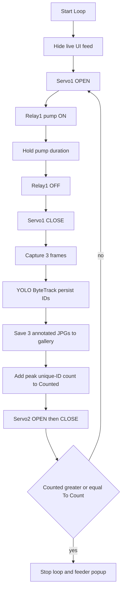

# YOLO still-frame counting (drop live inference)

## Current vs new behavior

Today, [`main.py`](main.py) prefers NCNN then IMX500, runs the model on every camera frame, draws **Detection Area / Count Area** plus a blue count line, and adds the **peak simultaneous box count** at the end of each hardware set.

New flow:

The camera page does **not** show the MJPEG stream by default. A **Live Feed** button toggles a YOLO-free preview so you can check camera position and set ROI. Automation still hides the feed. Overlay labels **Detection Area** / **Count Area**, the draggable count line, and live-per-frame inference go away. ROI stays.

## 1. Ultralytics `.pt` instead of NCNN / IMX500

- Load `YOLO(os.path.join(_PROJECT_ROOT, "models", "best.pt"))` once in `CameraManager.start()`.
- Add `ultralytics` to [`requirements.txt`](requirements.txt); drop `ncnn`.
- Stop importing/using [`ncnn_detector.py`](ncnn_detector.py) from `main.py`. Leave the file unused (or a thin unused leftover) rather than rewriting it as a runtime path.
- Remove IMX500 firmware setup, `pump_metadata()` live detect, `_draw_callback` NN parse, and NCNN `ShrimpCounter.process()` on every frame.
- Keep **Picamera2** via `PiCamCapture` for frames. Preview loop only `read()` + push JPEG; no YOLO.

Confidence still comes from Calibration (`calibration_mgr.get_confidence()`). Inference uses `model.track` with ByteTrack (see section 3). Draw `xyxy` + stable `id` on saved stills; keep ROI filter on box **center**. Raise `max_det` well above the current cap of 10 (use 100) so dense frames are not truncated.

**Note:** `models/best.pt` is not in the repo yet. You will add it before run. If missing, start the UI with a placeholder and log a clear error.

## 2. Drop count line / detection-area overlays; keep ROI

- Stop drawing the blue line and the **Detection Area / Count Area** text in `_annotate_and_count`.
- Remove the draggable `#countLine` overlay in [`camera.py`](camera.py) and the `/api/count_line` UI usage. ROI modal stays; retitle from “Detection Area (ROI)” to **ROI**.
- Disable live “snapshot when a shrimp is detected” (that path depended on live inference). Gallery saves become the 3 automation stills only.

## 3. Peak unique-ID count (brief miss + overlap)

The number sent to the app for each hardware set is **not** the union of every ID across time (that over-counts if IDs flicker). It is the **maximum number of distinct shrimp IDs whose centers are inside the ROI in any single frame** of the burst. That peak is added to Counted (`commit_cycle_count` keeps the same “add peak, then check To Count” role).

**Why IDs still matter:** the peak is counted in unique track IDs, not raw boxes. A shrimp that is missed for about a second and then seen again keeps the same ID, so it does not look like a new animal and does not inflate a later frame. Two overlapping shrimp should keep two IDs when the detector returns two boxes.

**Tracker (ByteTrack, `persist=True`):**

- Reset the tracker at the start of each set (`model.predictor = None`) so IDs do not carry into the next pump cycle.
- Ship a small project tracker yaml (e.g. [`models/shrimp_bytetrack.yaml`](models/shrimp_bytetrack.yaml)) copied from Ultralytics ByteTrack with:
  - `track_buffer` large enough for ~1s of lost tracks (at ~4 fps burst that is ~8–10 frames). A shrimp that drops out of one detection and returns within a second is re-matched, not given a new ID.
  - Slightly lower `track_high_thresh` / `new_track_thresh` so a dim overlapping shrimp can still be associated instead of spawning a duplicate ID.
  - `match_thresh` high enough that nearby overlapping centroids can still bind to existing tracks.
- Call `model.track(..., persist=True, tracker=that_yaml, conf=..., iou=0.80, max_det=100, verbose=False)`. Ultralytics `iou` is NMS: **higher** keeps overlapping boxes instead of merging two shrimp into one.

**Burst:** run more frames than we save, so the tracker has time to recover a 1s miss.

- Grab ~8 frames over ~2s (~0.25s apart) after the gate closes.
- On each frame: track, filter ROI, record `visible_ids`, update `peak = max(peak, len(visible_ids))`.
- Gallery: save **3** annotated JPGs (the peak-count frame plus two others evenly spaced, or first/peak/last). Boxes labeled `shrimp #id`.
- Unlabeled boxes (no track id yet): assign only if they do not IoU-match an existing ID in that frame.

Live Detected on the feeder panel during a set can show the running peak; Counted updates when the set commits that peak.

## 4. Automation: hide live feed; capture after pump off + gate close

Reorder [`PRESET_AUTOMATION_STEPS`](main.py) so it matches the requested hardware, then capture:

1. Servo1 OPEN  
2. Relay1 ON, hold existing pump duration (step duration, still editable)  
3. Relay1 OFF  
4. Servo1 CLOSE  
5. **New:** `camera_mgr.capture_count_burst()` — tracked burst, peak unique-ID count, save 3 annotated JPGs via existing `save_snapshot` / `~/esp32_snapshots`  
6. Servo2 OPEN (existing hold)  
7. Servo2 CLOSE  
8. If Counted &lt; To Count, loop; else same feeder popup as today  

Durations list length changes (insert pump-off as its own step). Update saved [`automation_defaults.json`](automation_defaults.json) handling so a stale 6-length list is ignored rather than breaking `set_durations`.

**UI:** when `/api/automation` reports `running`, hide `#videoFeed` / LIVE badge and show a status panel (pump / wait / capturing / counted). Do not point the img at `/video_feed` during the run. After stop, live feed stays off until the user presses **Live Feed** again.

`camera_capture_loop` should skip YOLO always; during automation it can keep grabbing so burst capture is immediate, but the UI will not display it.

## 5. Live Feed button (camera position check)

Add a **Live Feed** toggle next to Start Loop / Cancel / Flush on the camera page in [`camera.py`](camera.py).

- **Off (default):** viewfinder shows a dark placeholder ("Live feed off — press Live Feed to check camera position"). `#videoFeed` has no `/video_feed` src so the browser is not streaming.
- **On:** set `src="/video_feed"`, show the LIVE badge, preview frames only (ROI outline optional if ROI is not full-frame). No bounding boxes, no counting.
- **While automation is running:** button disabled; feed forced off. Tooltip/status: live view is unavailable during a count cycle.
- Toggle label: `Live Feed` when off, `Stop Live Feed` when on (same pattern as Start/Stop Loop).

ROI modal preview can use a single snapshot (`/api/snapshot` or the last cached JPEG) instead of requiring the live stream to be on.

## 6. Docs

Update [`README.md`](README.md): Ultralytics `YOLO("models/best.pt")`, no NCNN/IMX500 inference, peak unique-ID count after the gate closes, ByteTrack persistence ~1s, overlap-tolerant NMS, gallery of 3 annotated frames per set.

## Files to change

- [`main.py`](main.py) — model load, camera loop, annotate, automation steps, burst capture, peak unique-ID count
- [`camera.py`](camera.py) — Live Feed toggle, hide feed during loop, remove count-line HTML/JS
- [`models/shrimp_bytetrack.yaml`](models/shrimp_bytetrack.yaml) — ByteTrack buffer / match thresholds
- [`requirements.txt`](requirements.txt) — `ultralytics`, remove `ncnn`
- [`README.md`](README.md)

No browser hardware test on this Windows copy of the project; verify later on the Pi with `best.pt` present.
